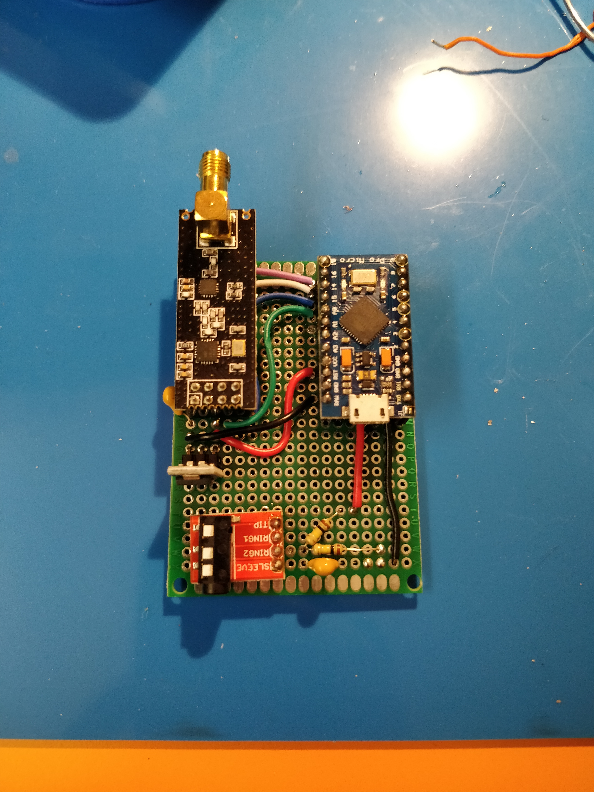
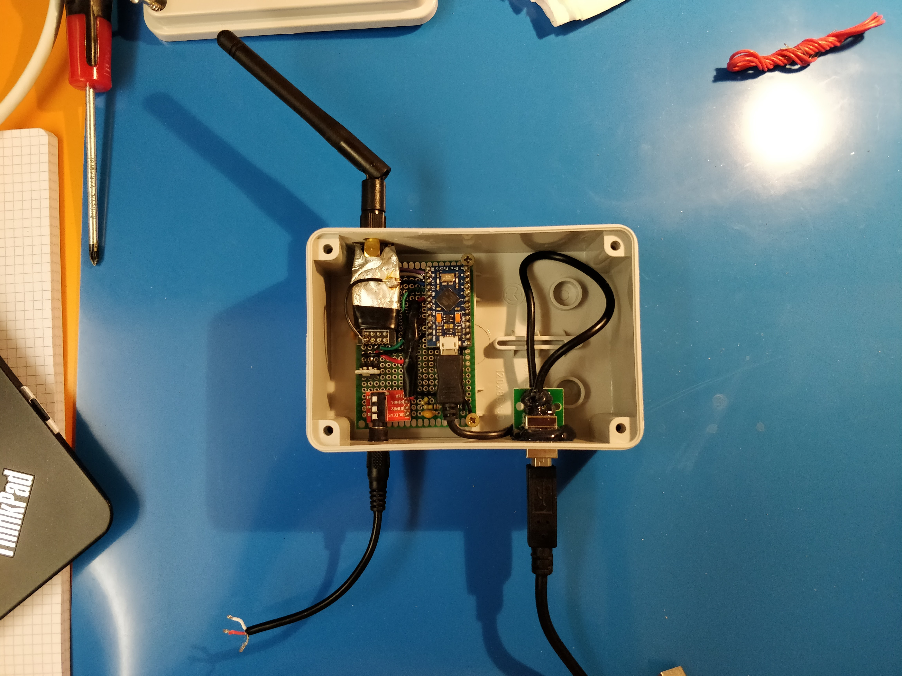

# Power Meter

A power meter to read the energy consumption of my house and sound an alert in case it exeeds a threshold.
It consist of two devices:
- A meter that measures the power value and broadcasts it
- An alarm that receives the value and upon need sounds the alarm

Current sensing is done via an external current transformer (CT).

## Meter pictures

TODO

## Firmware

The firmware of both devices can be flashed with the Arduino IDE software, selecting the **Arduino Leonardo** board.

### Libraries

- [RF24](https://github.com/nRF24/RF24)
- [LiquidCrystal_I2C](https://github.com/johnrickman/LiquidCrystal_I2C)

## Early prototype

## Notes

- A _true_ RMS reading of the sensor is crucial in order to get the real power value. The RMS reading is because of the nature of AC currents. The _true_ RMS is necessary because of the different current waveform of various types of loads (resistive, inductive, capacitive, etc.)
- Power consumption of the final build is .05 A at 5 V
- If the board ever gets **bricked**, [my guide](https://github.com/hexwell/notes-public/blob/master/en/electronics/pro_micro_brick.md) might be of use.
- OpenMeter update rate: 2s
- It might be nice to keep in this readme some pictures from the prototype when I design the PCB and update it.

## Theoretical resolution limits of SCT-013-000V current transformer (CT)

                    // Mains Characteristics
                    rms grid voltage = 230

                    transformer input = 100 A
                   transformer output = 1 V

                                  vcc = 4.683 V
                        adc divisions = 1024

                   volts per division = vcc / adc divisions
                                      = 0.004573
      divisions per transformer_range = transformer output / volts per division
                                      = 218
                    amps per division = transformer input / divisions per transformer_range
                                      = 0.4587
                           resolution = amps per division * rms_grid_voltage
                                      = 105.5010 W

    A lower rating transformer version can be used to get better resolution.
    This circuit can only take (VBUS / 2) input voltage, so the maximum peak current the meter
    can take is "transformer input current" * (VBUS / 2) / "transformer output voltage".
    For electrical systems rated 3.3 kW at 230 V the maximum amperage is 14.34 A,
    but peaks can greatly exceed this value, so at least 10x of this value should be accounted for in the design and transformer choice.
    The 60 A version is pretty much as low as it's possible to go.

## Questioning the whole thing

Since measuring power using just a current transformer is probably not really accurate, another option is reading the power measurement of the energy company's power meter directly, via it's IR port. That would require a lot of work tho, since the protocol needs to be reverse engineered. Irony of sorts, my italian energy company's meter is named OpenMeter.
